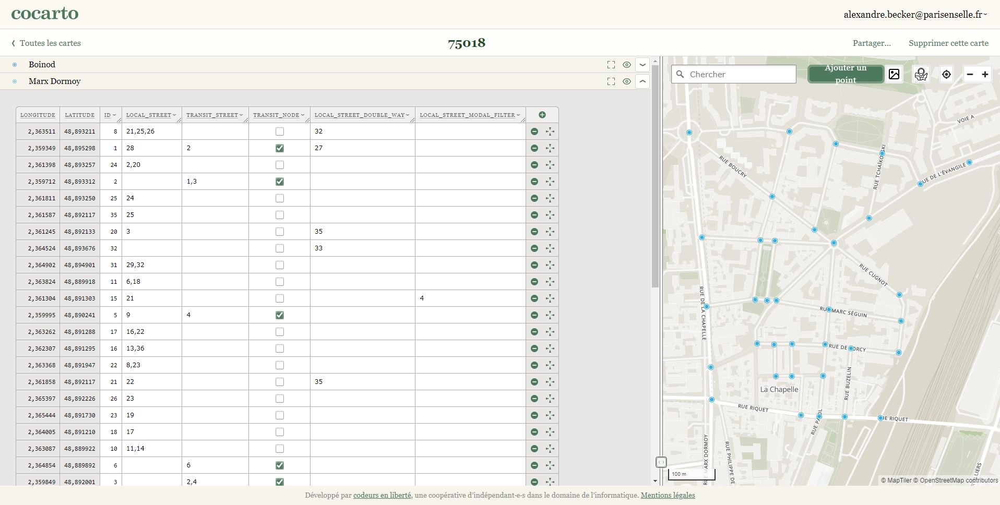

# street-plan

## Comment construire son quartier ?

Il faut configurer son quartier via un fichier geojson qui contiendra tout l'état initial du quartier. On peut par exemple utiliser [cocarto.com](https://cocarto.com/). Le geojson doit contenir un nuage de points, et ceux-ci doivent être annotés via les propriétés suivantes :

Type nombre entier:
- `id`

Type booléen:
- `transit_node`

Type texte:
- `local_street`
- `transit_street`
- `local_street_double_way` _(optionnel)_
- `local_street_modal_filter` _(optionnel)_
- `transit_exceptions` _(optionnel)_

*Notes :*
- les colonnes de type texte doivent toutes suivre le même format "21,25,26" c'est-à-dire une suite d'entiers séparés par des virgules.
- contrairement à la capture d'écran, toutes les colonnes doivent être définies en minuscule

## Quelles sont les étapes pour construire son plan ?

1. Créer une nouvelle couche dans [cocarto.com](https://cocarto.com/) ou son éditeur de geojson préféré
2. Ajouter les 7 colonnes listées ci-dessus
3. Créer chacun des points ou "noeuds" (5-10 min)
4. Remplir les 7 colonnes (30-45 min)

## Comment remplir les 7 colonnes ?

`id` est l'identifiant unique donné à chaque noeud (1, 2, 3, etc).

`local_street`, `local_street_double_way` et `local_street_modal_filter` permettent de définir des segments locaux de rue : à sens unique, à double-sens, ou à circulation interdite.

`transit_node` est utilisé pour définir un noeud de transit.

`transit_street` et `transit_exceptions` permettent de raffiner les axes de transits et les transits pertinents.

## Comment définir les transits pertinents ?

Si des noeuds de transit sont des noeuds successifs d'un même boulevard, on peut considérer inutile de vouloir montrer un rat run de l'un de ces noeuds à l'autre. On peut alors relier ces noeuds entre eux par `transit_street`. Ces noeuds feront alors partie d'un même "axe de transit", et l'algorithme ne cherchera pas à relier 2 noeuds du même axe de transit.

L'algorithme cherchera par contre à relier des axes de transit différents entre eux, de tel sorte qu'il passe par des noeuds locaux.

On peut également définir des exceptions via `transit_exceptions` (non affiché sur la capture d'écran). Si 1 et 14 sont des noeuds de transit mais qu'on considère que les relier n'est pas pertinent et encombrerait la représentation du plan, on peut ajouter la valeur "14" dans `transit_exceptions` à la ligne où _id_ vaut 1. L'algorithme ignorera les rat runs démarrant de 1 et aboutissant à 14.