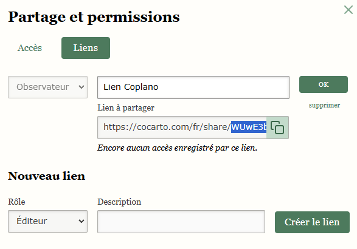

# Coplano

Coplano est une ébauche d'assistant de plan de circulation. En cliquant sur les flèches, on fait apparaitre (ou disparaitre) des rat runs. Cela marche uniquement sur desktop. L'idée est de facilement dessiner les plans de circulation, de visualiser les rat runs, et peut-être à terme de générer semi-automatiquement une partie des plans.

Voilà un exemple de plan de circu pour le quartier Boinod/Simplon dans le 18ème arrondissement de Paris :
-  Axes actuels
-  Axes modifiés
-  Rat runs

## Comment utiliser Coplano ?

Il y a trois phases :
1. **Une phase d'initialisation :** création d'un geojson pour décrire un quartier sur [cocarto.com](cocarto.com)
2. **Une phase de configuration :** correction de noeuds et définition des transits
3. **Une phase d'analyse :** ouvrir le plan dans Coplano et analyser les plans de circulation possibles

## Phase I - Initialisation

Le fichier geojson décrit les carrefours (noeuds) et les sens de circulation du quartier, simples ou doubles. Le geojson doit contenir un nuage de points et ceux-ci doivent être annotés via les propriétés ci-dessous. Pour le créer, on recommande d'utiliser [cocarto.com](https://cocarto.com/).

Un exemple est visible ici : https://cocarto.com/fr/share/TGeknxKpH8CPTvu2

### Configuration manuelle dans Cocarto

Etapes (plusieurs heures) :
1. Créer une nouvelle couche dans [cocarto.com](https://cocarto.com/)
2. Ajouter les 7 colonnes listées ci-dessous
3. Créer chacun des points ou "noeuds" (de 30 min à 1 heure)
4. Remplir les 7 colonnes (de 1 à plusieurs heures)
5. Exporter le fichier geojson et l'importer dans Coplano

### Configuration dans Cocarto à l'aide de l'importateur

Etapes (environ 20 minutes) :
1. Créer une nouvelle couche dans [cocarto.com](https://cocarto.com/)
2. Ajouter les 7 colonnes listées ci-dessous
3. Sur l'[importateur Coplano-OSM](https://main--coplano-import-osm.netlify.app/), cliquer sur l'icône polygone, dessiner le périmètre du quartier à étudier, télécharger le geojson
4. Sur [cocarto.com](https://cocarto.com/), cliquer sur _Importer_ et importer le fichier geojson
5. Construire une URL d'accès à Coplano (voir ci-dessous) et ouvrir son plan

### Configuration : colonnes à ajouter

Type nombre entier:
- `id`
- `osm_id`

Type booléen:
- `transit_node`

Type texte:
- `local_street`
- `local_street_double_way`
- `local_street_modal_filter`
- `transit_whitelist`
- `transit_street` _(optionnel)_
- `transit_blacklist` _(optionnel)_

*Notes :*
- les colonnes de type texte doivent toutes suivre le même format "21,25,26" c'est-à-dire une suite d'entiers séparés par des virgules.
- contrairement à la capture d'écran, tous les noms de colonnes doivent être définis en minuscule

### Construire une URL Coplano

Format d'URL Coplano :

    https://coplano.fr/new.html?geojson=<URL d'accès au geojson cocarto>?token=<token d'accès>

L'URL Geojson Cocarto et le token s'obtiennent ainsi :
- **URL Geojson Cocarto** : `Cocarto > Aller dans sa couche > Exporter > Clic-droit sur GeoJSON > Copier le lien`

- **Token** : `Cocarto > Aller dans sa couche > Partager > Liens > Nouveau lien > Rôle > Observateur > Description: "Lien Coplano" > Créer le lien de partage > Voir sur le lien la dernière partie après la dernière barre oblique et la copier (le token)`

Par exemple, une URL Geojson Cocarto est `https://cocarto.com/fr/layers/03f73170-9dea-4006-879b-ec040f30a950.geojson` et pour un lien de partage `https://cocarto.com/fr/share/TGeknxKpH8CPTvu2`, le token serait `TGeknxKpH8CPTvu2`. Une fois l'URL du GeoJSON construite et le token obtenu, on peut les valider en combinant `<URL Geojson>?token=<token>`. En la collant dans la barre son navigateur, un fichier geojson doit être téléchargé (à faire dans une nouvelle fenêtre en mode incognito).

Exemple d'URL Coplano : https://coplano.fr/new.html?geojson=https://cocarto.com/fr/layers/03f73170-9dea-4006-879b-ec040f30a950.geojson?token=yaRfz7Yx6hBrcLPH

## Phase II - Configuration des noeuds

A ce stade, il faut avoir créé sa couche dans Cocarto, avoir chargé ses premiers points, et avoir construit une URL Coplano pour visualiser une première fois son plan.

En ouvrant l'URL Coplano, il est possible que des amélioratoins du plan soient nécessaires. C'est l'objet de cette étape, qui consiste à :
- nettoyer les noeuds (éventuellement, supprimer les doublons, en cas d'import OSM)
- retoucher certains segments de rue
- définir les transits

Pour ce faire, il est recommandé d'ouvrir deux fenêtres navigateur, l'une sur son _URL Coplano_, l'autre sur _Cocarto_ avec sa couche ouverte. Le processus est alors le suivant :
1. Aller sur l'URL Coplano
2. Identifier des problèmes
3. Aller sur Cocarto, faire des corrections
4. Aller sur Coplano, recharger la page (F5) - le plan avec la nouvelle configuration apparaît
5. Revenur à l'étape 2, tant que des problèmes sont présents

### Annotation des colonnes dans Cocarto

Chaque noeud est identifié au moyen d'un identifiant `id`, un nombre entier qui doit être unique (1, 2, 3, etc). L'`id` servira ensuite à définir les sens de circulation et les axes de transits.

`local_street`, `local_street_double_way` et `local_street_modal_filter` permettent de définir les sens de circulation dans les segments de rue locaux :
- `local_street` : segment à sens de circulation unique
- `local_street_double_way` : à double-sens
- `local_street_modal_filter` : aucun sens de circulation

`transit_node` est utilisé pour définir un noeud de transit.

`transit_whitelist`, `transit_blacklist` et `transit_street` permettent de raffiner les axes de transits et les transits pertinents.

### Comment définir les transits pertinents ?

Par défaut, l'algorithme cherche **tous les chemins possibles pour relier un noeud de transit à un autre noeud de transit par des segments de rue locaux**.

On peut affiner cette recherche par trois moyens :
- `transit_whitelist` : on définit explicitement vers quel noeud de "destination" l'algorithme cherchera à relier le noeud origine. C'est l'option la plus simple. A noter, la valeur "0" est une exception et désactive toute recherche.
- `transit_blacklist` : il peut paraître peu pertinent de relier tel noeud de transit à tel noeud de transit. On peut alors définir des exceptions. Si 1 et 14 sont des noeuds de transit mais qu'on considère que les relier n'est pas pertinent et encombrerait la représentation du plan, on peut ajouter la valeur "14" dans _transit_exceptions_ à la ligne où _id_ vaut 1. L'algorithme ignorera les rat runs démarrant de 1 et aboutissant à 14.
- `transit_street` : si des noeuds de transit sont des noeuds successifs d'un même boulevard, on peut considérer inutile de vouloir montrer un rat run de l'un de ces noeuds à l'autre. On peut alors relier ces noeuds entre eux par _transit_street_. Ces noeuds feront alors partie d'un même "axe de transit" ou _transit set_, et l'algorithme ne cherchera pas à relier 2 noeuds du même axe de transit. L'algorithme cherchera par contre à relier des axes de transit différents entre eux, de tel sorte qu'il passe par des noeuds locaux.

### Erreurs au chargement

Une relation entre un noeud A et un noeud B ne peut être définie qu'une et une seule fois. Une erreur est générée si A référence B et B référence A.

En cas d'erreur, une exception s'affiche (dans la console, F12) et le chargement est interrompu.

## Phase III - Analyse

En cliquant sur un segment, la _flèche_ itère entre ces états :
- sens de circulation 
- sens de circulation inverse
- sens de circulation double
- aucun sens de circulation

L'état initial défini dans le geojson est en , les autres états en . En  s'affichent les rat runs.

# Comment contribuer au projet ?

## Ajouter un plan ou une version d'un plan

A venir. Pour le moment, il est recommandé de construire et partager l'URL d'accès Coplano.

## Contribuer au code

Il y a beaucoup à faire et les contributions sont bienvenues. Pour lancer le code en local, on peut par exemple utiliser la commande ci-dessous puis aller sur http://localhost:8000/ :

`python -m http.server`

Pour faire tourner les tests, on lance :

`npm test`

Cela donnera un résultat tel que ci-dessous :

A noter qu'il est nécessaire d'installer Node JS pour lancer les tests. Voir https://nodejs.org/.